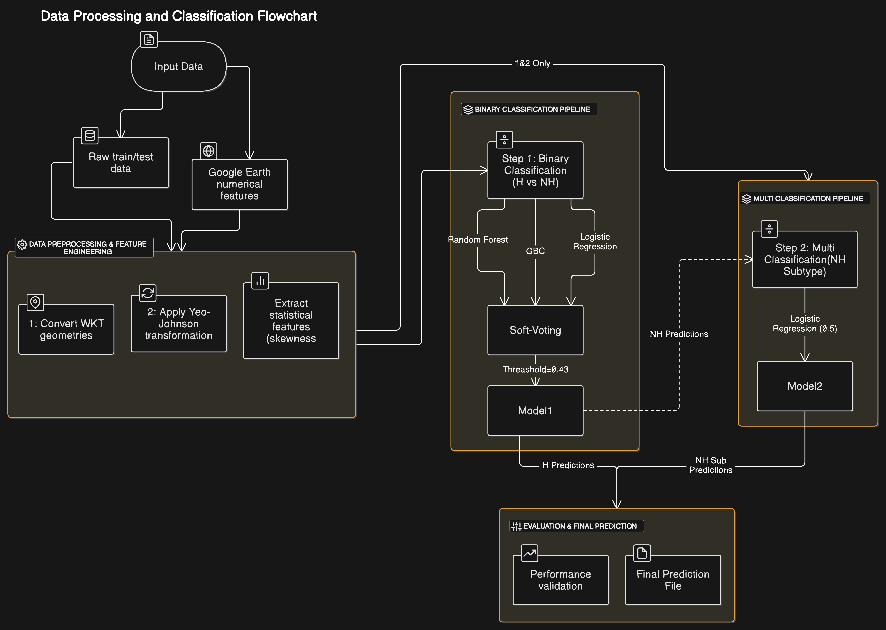

# Telangana Crop Health Challenge

## Objective
This project aims to predict the health status of crops using numerical and geospatial features extracted from Google Earth data. The classification problem is tackled through a stepwise approach, handling class imbalance effectively.

---
## Data Analysis & Preprocessing

### Data Sources:
- **Train and Test Data**: Contain crop health labels and geospatial information.
- **Google Earth Engine Features**: Used for deriving numerical attributes.

### Data Cleaning & Feature Engineering:
- **Geometry Processing**: Converted WKT-based geometries into geospatial formats.
- **Feature Extraction**: Numerical features were selected and transformed using Yeo-Johnson.
- **Statistical Feature Engineering**: Derived features such as skewness and kurtosis.
- **Categorical Feature Analysis**: Reviewed but ultimately excluded due to poor predictive power.

---
## Classification Approach

### Decomposition Strategy:
1. **Binary Classification:** Healthy (H) vs Not Healthy (NH)
2. **Multiclass Classification:** Predicting NH subtypes

### Handling Class Imbalance:
- **SMOTE applied to augment class 2** in the NH classification.

### Model Selection:
- **Soft Voting Classifier** combining:
  - Logistic Regression
  - Random Forest
  - Gradient Boosting
- **Logistic Regression** used for NH classification.

---
## Results & Findings
- **Best Threshold:** 0.43 (F1-score: 0.738) on Zindi Public Leaderboard
- **Soft Voting improved generalization**, reducing overfitting.
- **Categorical features were analyzed but not used** due to lack of discriminative power.

This approach ensures a robust classification pipeline for crop health prediction with a focus on handling imbalanced datasets efficiently.

